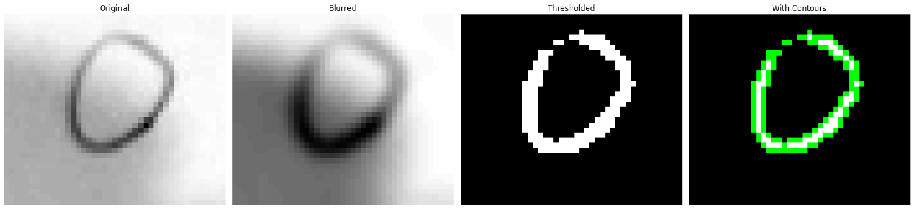
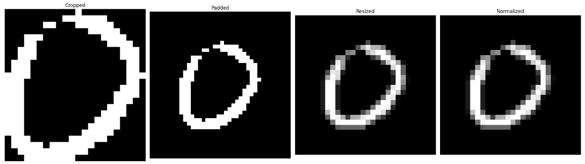

# THỰC HÀNH CS114-LAB01: HANDWRITTEN DIGIT CLASSIFICATION

## Data: Handwritten digit 
```bash
num_data.zip
```


## Run
Sử dụng file ```Final_CS114_2024_DigitClassification.ipynb``` để train model từ ```MNIST dataset```, sau đó đánh giá độ hiệu quả của model dựa trên ```Handwritten digit dataset (num_data.zip)```
```bash
Final_CS114_2024_DigitClassification.ipynb
```

## Quá trình xử lý ảnh trước khi đưa vào model để dự đoán



